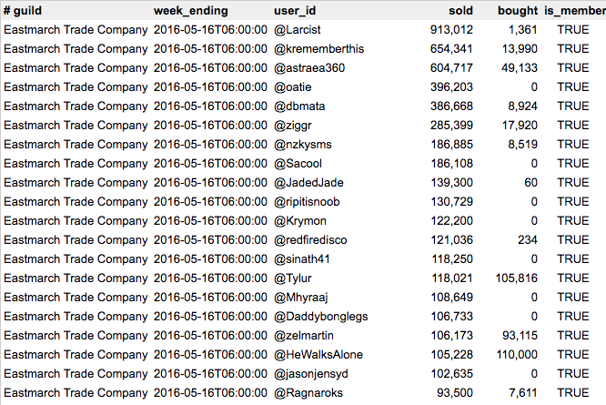

Does your Elder Scrolls Online guild enforce a sales quota? Use [Master Merchant](http://www.esoui.com/downloads/info928-MasterMerchant.html) to see top sellers? If so, you can do all this from within Master Merchant and do not need this add-on.

But if you also want to record sales to a spreadsheet, that's where this add-on comes in.

This add-on scans Master Merchant sales history, summarizes gold totals for your guild's sellers and buyers over last week, then writes that to a SavedVariables file. It can then convert that SavedVariables file to a comma-separated-value file suitable for import into a spreadsheet.

Column list:

* guild name
* week ending on date
* player account @name
* sold: gold earned in the guild trader last week
* bought: gold spent in the guild trader last week
* is a guild member? Many buyers aren't members.

Instructions:

* Click "Save Data Now" button. Add-on will scan Master Merchant and guild membership lists.
* Log out (or relog). ESO will then save data, writing SavedVariables/GuildSalesQuota.lua.
* From a terminal window, run `% cd ~/Documents/Elder Scrolls Online/live/AddOns/GuildSalesQuota` `% lua GuildSalesQuota_to_csv.lua` (Or drag and drop `GuildSalesQuota_to_csv.lua` onto `lua52.exe`) This creates `SavedVariables/GuildSalesQuota.csv`
* Import `GuildSalesQuota.csv` into a spreadsheet.

`GuildSalesQuota_to_csv.lua` requires that you have downloaded and installed a standalone Lua interpreter, presumably from (lua.org)[http://www.lua.org/].

--Z

