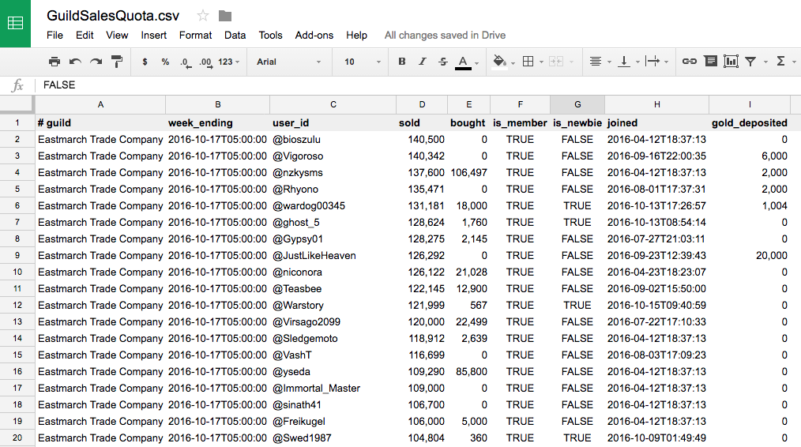

Want to know which guild members donated gold to the guild this week?
Using that information to drive a weekly guild raffle?

This add-on scans guild bank history, then saves all gold deposits to a SavedVariables file. It can then convert that SavedVariables file to a CSV comma-separated-value file suitable for import into a spreadsheet.

* Click "Save Data Now" button. Add-on will fetch Guild Bank history from ESO's server and note all gold deposits.
* Log out (or relog). ESO will then save data, writing SavedVariables/GuildGoldDeposits.lua
* From a terminal window, run  `% cd ~/Documents/Elder Scrolls Online/live/AddOns/GuildGoldDeposits` `% lua GuildGoldDeposits_to_csv.lua` This creates SavedVariables/GuildGoldDeposits.csv
* Import GuildGoldDeposits.csv into a spreadsheet.

`GuildGoldDeposits_to_csv.lua` requires that you have downloaded and installed a standalone Lua interpreter, presumably from [lua.org](http://www.lua.org/).

--Z

